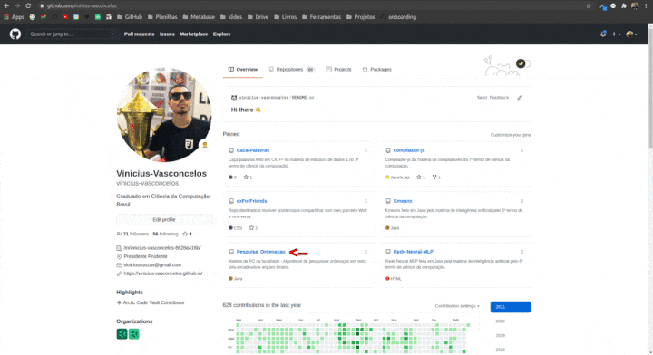
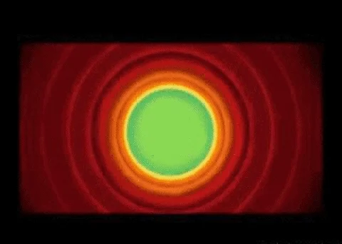

## :red_circle::black_circle::white_circle: Eae pessoal, tudo bem ? Sou o Vinicius Vasconcelos 👋

Nascido em **01/1996** em São Paulo :brazil:. Sou grande entusiasta por obter novos conhecimentos e os compartilhar,  foi assim que iniciei minha caminhada na área da tecnologia e desenvolvimento :computer:.

Sou graduado :man_student::man_technologist: em [Ciência da Computação](https://www.unoeste.br/graduacao/ciencia-computacao), [técnico em Informática](https://www.sp.senac.br/senac-presidente-prudente/cursos-tecnicos/curso-tecnico-em-informatica) e [técnico em Informática para Internet](https://www.sp.senac.br/senac-presidente-prudente/cursos-tecnicos/curso-tecnico-em-informatica-para-internet), **acredito fortemente que os requisitos mínimos para qualquer coisa é ter força de vontade ! :book: :muscle:**

Atualmente trabalho com **tecnologia** e **educação** duas coisas que eu amo :heartbeat: !!! Durante minha graduação já ministrava mini-cursos na semana de informática na instituição onde me formei. Logo após formado, continuei compartilhando meu conhecimento assim me tornando [instrutor na Udemy](https://www.udemy.com/user/vinicius-souza-vasconcelos-dos-santos/) :book: :computer: e atualmente sou instrutor de **Back-end** e **Computer Science** na [Trybe](https://www.betrybe.com/) :man_teacher: :green_heart: :rocket:.

 
---------------

---------------

<table>
<tr><th>
  
  #### Tecnologias Estudadas :nerd_face: :man_technologist:
  
</th><th>
  
#### Mais Interesses Meus :books: :rocket:

</th></tr>
<tr><td>

Linguagens/Tecnologias/Ferramentas/...   | |
--------- | ------
C/C++ | :heavy_check_mark: |
Java | :heavy_check_mark: |
Java Web | :heavy_check_mark: |
PHP | :heavy_check_mark: |
JavaScript/Node.JS | :heavy_check_mark: |
MongoDB | :heavy_check_mark: |
Firebase | :heavy_check_mark: |
HTML5 | :heavy_check_mark: |
CSS3 | :heavy_check_mark: |
jQuery | :heavy_check_mark: |
Bootstrap | :heavy_check_mark: |
Bulma | :heavy_check_mark: |
Jest | :heavy_check_mark: |
Git | :heavy_check_mark: |

</td><td>
  
Técnicas/Tecnologias/Ferramentas/...   | |
--------- | ------
Design thinking | :hourglass_flowing_sand: |
UI Design | :hourglass_flowing_sand: |
UX Design Web | :hourglass_flowing_sand: |
Figma | :hourglass_flowing_sand: |
Adobe UX | :hourglass_flowing_sand: |
Métodos Ágeis | :hourglass_flowing_sand: |
Electron | :hourglass_flowing_sand: |
Deno | :hourglass_flowing_sand: |
Vue.JS | :hourglass_flowing_sand: |
SASS | :hourglass_flowing_sand: |
Wordpress | :hourglass_flowing_sand: |
Mundo Linux | :hourglass_flowing_sand: |
Perfomace Web | :hourglass_flowing_sand: |
Designer Patterns | :hourglass_flowing_sand: |

</td></tr> </table>

---------------
<h4 align="center">
:warning: Organização dos repositórios :warning:
</h4>

Quase 90% dos meus repositórios são de estudos na [Udemy](https://www.udemy.com/pt/), [Origamid](https://www.origamid.com/), dentre outras plataformas...Porém todos possuem `readme` com referência e link a qual curso o projeto foi feito :detective:.

~~Todos~~ meus repositórios possuem `readme` com decrição do que foi feito e qual tecnologia foi usada em cada exercício/aplicação desenvolvida, como é demosntrado no *gif* abaixo: :grin:

<table>
<tr><td>
  
 
  
</td><td>
  

</td></tr>
</table>

---------------

### :red_circle::black_circle::white_circle: E isso é tudo pessoal :call_me_hand:

  
    
  
  
    
  

<!-- > Icons made by [Freepik](https://www.freepik.com) -->
